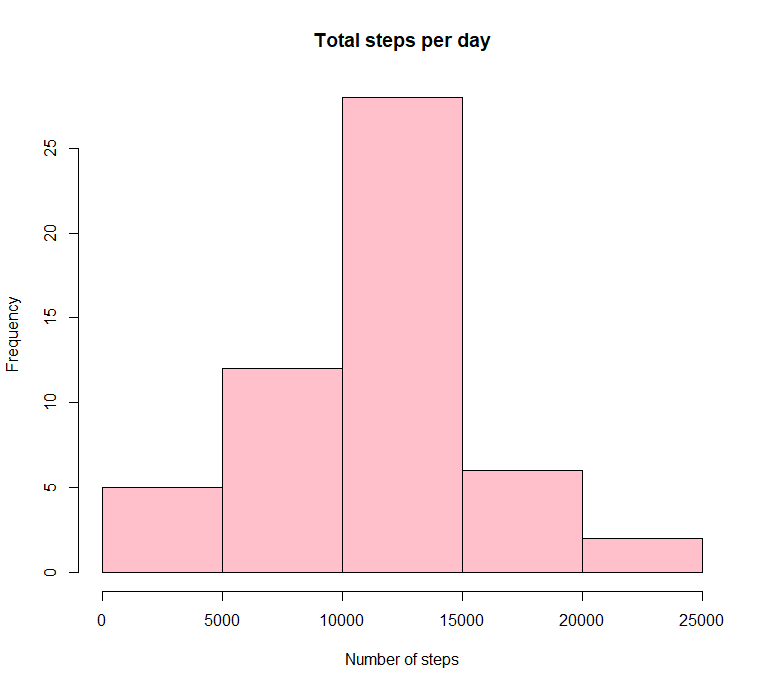
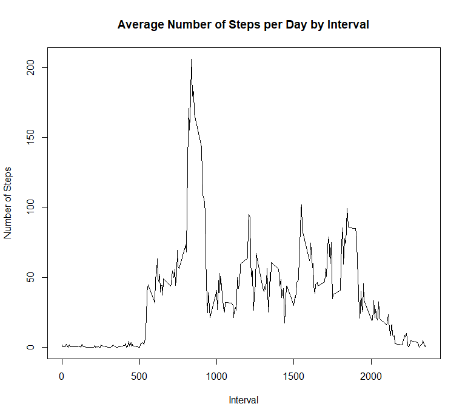
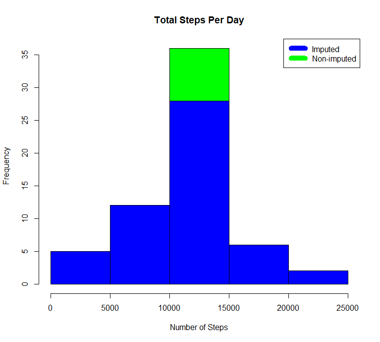
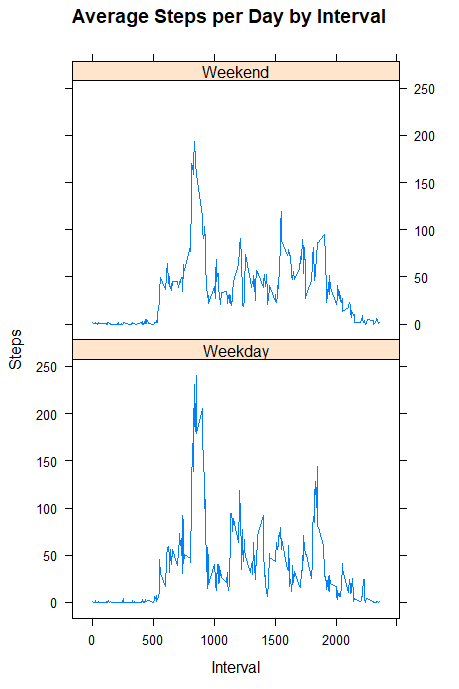

#### Introduction

This assignment is part of **Reproducible Research** course in Data
Science specialization.

#### Data

This assignment makes use of data from a personal activity monitoring
device. This device collects data at 5 minute intervals through out the
day. The data consists of two months of data from an anonymous
individual collected during the months of October and November, 2012 and
include the number of steps taken in 5 minute intervals each day.
Dataset can be downloaded from:
[here](https://d396qusza40orc.cloudfront.net/repdata%2Fdata%2Factivity.zip)
\[52K\]

#### Loading and preprocessing the data

    if(!file.exists("activity.csv")) {
        temp <- tempfile()
        download.file("http://d396qusza40orc.cloudfront.net/repdata%2Fdata%2Factivity.zip",temp)
        unzip(temp)
        unlink(temp)
        rm(temp)
    }

    ACdata <- read.csv("activity.csv")

#### What is mean total number of steps taken per day?

Sum steps by day, create Histogram, and calculate mean and median.

    spd <- aggregate(steps~date, ACdata, sum)
    hist(spd$steps, main = "Total steps per day", col = "pink", xlab = "Number of steps")

Caluclating mean and median of steps per day

    rmean <- mean(spd$steps)
    rmedian <- median(spd$steps)

Mean steps per day is: `10766.19` Median of steps per day is: `10765`

#### What is the average daily activity pattern?

-   Calculate average steps for each interval for all days.
-   Plot the Average Number Steps per Day by Interval.
-   Find interval with most average steps.

<!-- -->

    spi <- aggregate(steps ~ interval, ACdata, mean)
    plot(spi$interval, spi$steps, type="l", xlab="Interval", ylab="Number of Steps", main="Average Number of Steps per Day by Interval")

Finding the 5-minute interval that, on average, contains the maximum
number of steps

    maxi <- spi[which.max(spi$steps),1]

#### Imputing missing values

Missing data were replaced with the average for each interval. For
example missing data for 2012-10-01 were replaceed with mean: `10766.19`

    missdatasum <- sum(!complete.cases(ACdata))
    imputed_miss_data <- transform(ACdata, steps = ifelse(is.na(ACdata$steps), spi$steps[match(ACdata$interval, spi$interval)], ACdata$steps))

As for 2012-10-01 NA's can be observed througout the day, this is first
day of observation, so zeros were imputed to keep rising trend in
dataset.

    imputed_miss_data[as.character(imputed_miss_data$date) == "2012-10-01", 1] <- 0

Now total steps per day were recalculated and histogram plotted

    spd_i <- aggregate(steps ~ date, imputed_miss_data, sum)
    hist(spd_i$steps, main = "Total Steps Per Day", col="green", xlab="Number of Steps")

    hist(spd$steps, main = "Total Steps Per Day", col="blue", xlab="Number of Steps", add=T)
    legend("topright", c("Imputed", "Non-imputed"), col=c("green", "blue"), lwd=10)

New mean and new median ware calculated for transformed dataset:

    rmean_i <- mean(spd_i$steps)
    rmedian_i <- median(spd_i$steps)

..so difference between imputed and non-imputed data could also be
computed:

    mean_diff <- rmean_i - rmean
    med_diff <- rmedian_i - rmedian

The total difference between imputed and non-imputed data was also
calculated.

    total_diff <- sum(spd_i$steps) - sum(spd$steps)

###### Summary of computation

-   new mean equals `10589.69`
-   new median equals `10766.19`
-   difference between mean for imputed and non-imputed data is
    `-176.49`
-   difference between median for imputed and non-imputed data is `1.19`
-   total number of steps in imputed data than in non-imputed data is
    higher by `75 363` steps

#### Are there differences in activity patterns between weekdays and weekends?

In order to determine if acctivity pattern is different in weekdays and
weekends the dataset was labled with "day of week" flag: "Weekday" or
"Weekend" and plot was created to see if the difference in patterns can
be marked.

Code for labeling data:

    imputed_miss_data$dow <- ifelse(wday(imputed_miss_data$date, week_start = getOption("lubridate.week.start", 1)) %in% c(1,5), "Weekday", "Weekend")

Creating plot:

    spi_i <- aggregate(steps ~ interval + dow, imputed_miss_data, mean)
    xyplot(spi_i$steps ~ spi_i$interval|spi_i$dow, main="Average Steps per Day by Interval",xlab="Interval", ylab="Steps",layout=c(1,2), type="l")

In general we can see that overall activity during the weekend is
slightly *higher* than during the week. Eventhough the maximum number of
steps is lower than during the week, there are more intervals with
higher number of steps. And these intervals with more steps follow
eachother, creating kind of "pleatous" in the chart.
